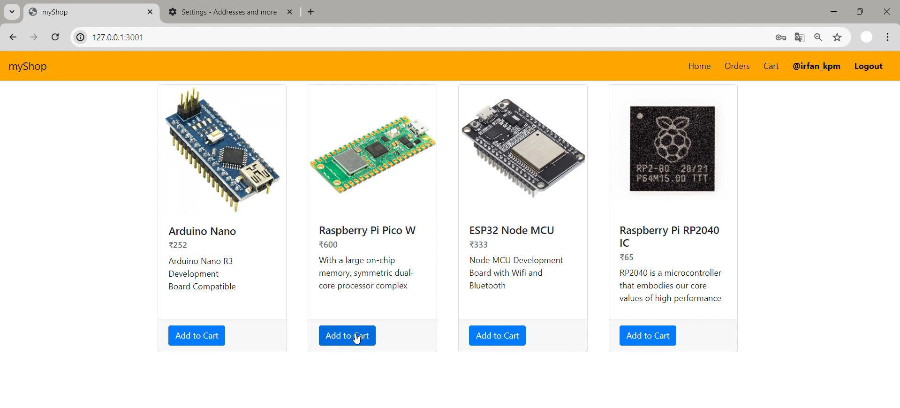
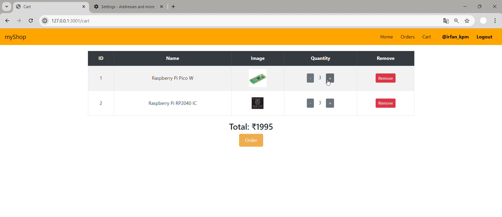
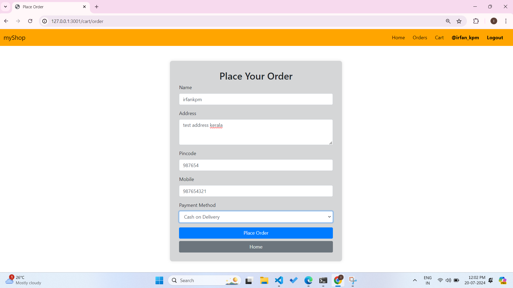
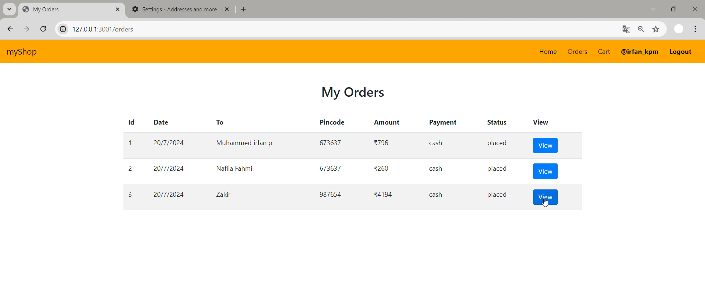
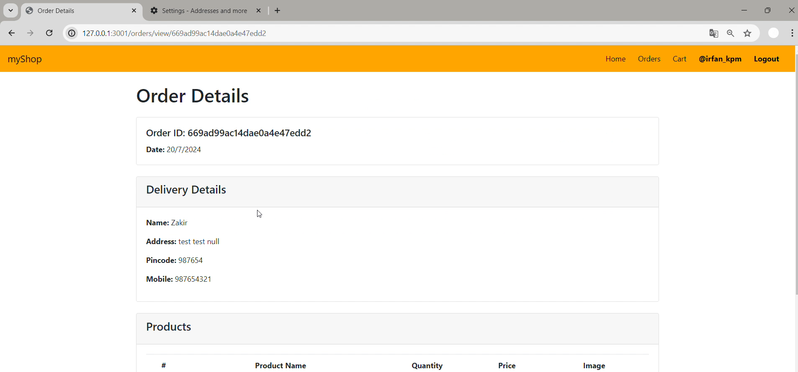
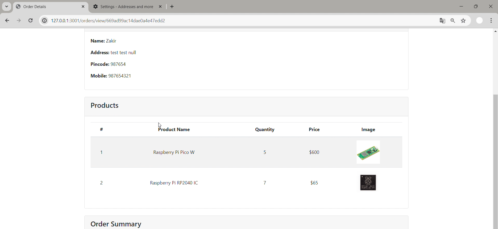

# myShop-my-first-web-project

This project is an e-commerce web application that includes features such as user authentication, an admin panel for product management, and various functionalities for users to shop online.

## ScreenShots









## Features

- **User Signup**
- **User Login / Logout**
- **Admin Login / Logout**
- **Admin Panel to Add New Products**
- **User - Add to Cart**
- **Edit Quantity in Cart**
- **Order**
- **Order Summary**

## Technologies Used

- **Frontend:** HTML, CSS, JavaScript
- **Backend:** Node.js, Express.js
- **Database:** MongoDB (using Mongoose ODM)

## Installation

1. **Clone the repository:**

    ```bash
    https://github.com/IrfanKpm/myShop-my-first-web-project.git
    ```

2. **Navigate to the project directory:**

    ```bash
    cd myShop-my-first-web-project
    ```

3. **Install dependencies :**

    ```bash
    npm install
    ```

4. **Start the server:**

    ```bash
    npm start
    ```

